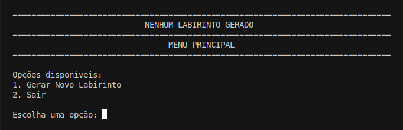
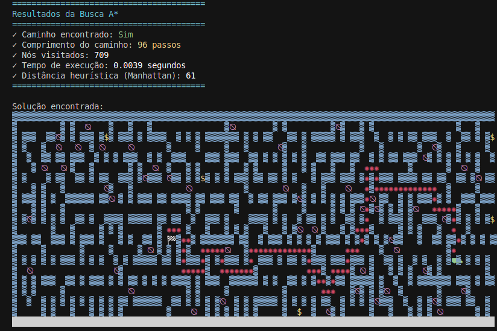
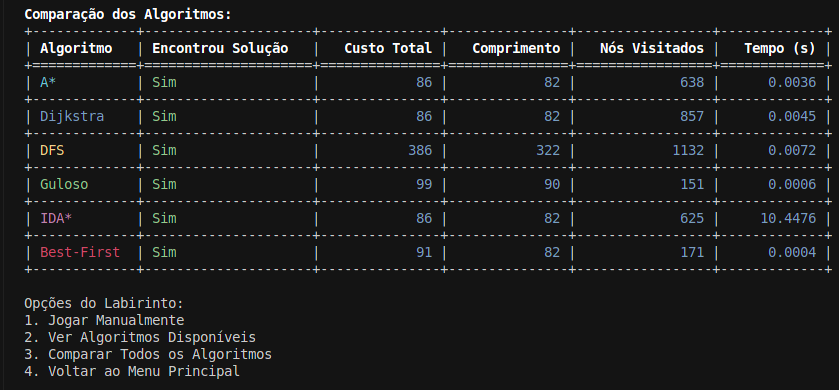

# Labirinto - Comparação de Algoritmos Gulosos e Busca

**Conteúdo da Disciplina**: Projetos e Algoritmos - Algoritmos Gulosos<br>

## Alunos
|Matrícula | Aluno |
| -- | -- |
| 21/1061897  |  Igor De Sousa Justino |
| 21/1061968  |  João Pedro Veras Gomes |

## Sobre 
Este projeto implementa um jogo de labirinto que compara diferentes estratégias de resolução, com foco especial em algoritmos gulosos. O labirinto é gerado utilizando o Algoritmo de Prim, garantindo a criação de labirintos perfeitos e totalmente conectados. O labirinto é composto por muros e obstáculos com diferentes níveis de dificuldade, permitindo uma análise prática das vantagens e limitações das abordagens gulosas em comparação com outros métodos de busca.

## Apresentação
A apresentação pode ser acessada [clicando aqui](https://youtu.be/TItLdQwibVA).

## Algoritmos Implementados


1. **A* (A-Star)**

   * Busca informada que une teoria de grafos e heurística para encontrar soluções ótimas.
   * Utiliza a função de avaliação `f(n) = g(n) + h(n)`, onde:
     * `g(n)`: custo acumulado do ponto de partida até o nó atual.
     * `h(n)`: estimativa admissível do custo restante até o objetivo.
   * Garante o caminho de custo mínimo se a heurística for admissível e consistente.
   * Geralmente mais eficiente que o Dijkstra puro em labirintos grandes.

2. **Dijkstra**

   * Algoritmo clássico de caminho mínimo em grafos ponderados.
   * Mantém uma fila de prioridades baseada nas distâncias conhecidas (`g(n)`).
   * Expande sempre o nó com menor custo acumulado.
   * Garante encontrar o caminho ótimo, mas não faz uso de heurística.
   * Pode ser mais lento em grandes espaços de busca devido à exploração exaustiva.

3. **DFS (Depth-First Search)**

   * Explora cada ramo até o fim antes de retroceder (backtracking).
   * Implementação baseada em pilha (recursiva ou explícita).
   * Baixa complexidade de memória, pois armazena apenas o caminho atual.
   * Não garante encontrar o menor caminho e pode visitar muitos nós desnecessariamente.

4. **Busca Gulosa (Greedy Best-First Search)**

   * Estratégia ambiciosa que avalia nós apenas pela heurística `h(n)`.
   * Escolhe sempre o próximo nó que parece mais próximo do objetivo.
   * Muito rápida e de baixo consumo de memória.
   * Não garante otimalidade e pode ficar presa em becos sem saída ou mínimos locais.

5. **Best-First Search**

   * Variante híbrida que combina heurística e custo de caminho em uma única função de avaliação.
   * Geralmente usa `f(n) = α · g(n) + (1 - α) · h(n)` ou similar, ajustando peso entre exploração e heurística.
   * Mais equilibrado que a busca gulosa pura, oferecendo melhor qualidade de solução em labirintos complexos.
   * Mantém desempenho computacional razoável, desde que os pesos sejam bem calibrados.

---

### Resumo Comparativo

| Algoritmo             | Heurística | Otimalidade | Complexidade de Memória | Comentário Rápido                                             |
| --------------------- | ---------- | ----------- | ----------------------- | ------------------------------------------------------------- |
| **A***               | Sim        | Sim         | Alta                    | Melhor em grandes labirintos com heurística confiável.        |
| **Dijkstra**          | Não        | Sim         | Alta                    | Exploração uniforme, sem direção preferencial.                |
| **DFS**               | Não        | Não         | Baixa                   | Rápido em caminhos longos, mas não otimiza distância.         |
| **Busca Gulosa**      | Sim        | Não         | Média                   | Muito ágil, porém arriscado em becos sem saída.               |
| **Best-First Search** | Sim        | Parcial     | Média                   | Flexível, permite ajustar trade-off entre custo e heurística. |

## Screenshots

### Menu Principal



### Labirinto 


### Labirinto em Execução


### Comparação entre Algoritmos


## Instalação 
**Linguagem**: Python<br>
**Framework**: N/A<br>

### Pré-requisitos
- Python 3.6 ou superior
- Biblioteca colorama
- Biblioteca tabulate

### Comandos
```bash
# Clone o repositório
git clone https://github.com/projeto-de-algoritmos-2025/Labirinto_Algoritmos_Gulosos_e_Busca

# Entre na pasta do projeto
cd Pa-Labirinto-3

# Instale as dependências
pip install -r requirements.txt

# Execute o projeto
python main.py
```

## Uso 
Após executar o projeto, você terá acesso ao menu principal com as seguintes opções:

1. **Gerar Novo Labirinto**: Cria um novo labirinto para jogar
2. **Sair**: Encerra o programa

Ao gerar um novo labirinto, você pode:
- Jogar manualmente usando as teclas WASD
- Ver soluções usando diferentes algoritmos
- Comparar o desempenho dos algoritmos

### Controles do Jogo
- **W**: Mover para cima
- **A**: Mover para a esquerda
- **S**: Mover para baixo
- **D**: Mover para a direita
- **Q**: Sair do jogo

### Elementos do Jogo
- ✖ (Verde): Ponto de início
- 🏁 (Vermelho): Ponto de chegada
- ◎ (Amarelo): Jogador
- ★ (Amarelo): Moedas para coletar
- ⦰ (Magenta): Barreiras (causam recuo)
- ▓ (Azul): Paredes do labirinto

## Outros 
### Métricas de Comparação
Os algoritmos são comparados usando as seguintes métricas:
- **Encontrou Solução**: Indica se o algoritmo encontrou um caminho válido
- **Comprimento do Caminho**: Número de passos na solução
- **Custo Total**: Soma dos custos de movimento (incluindo penalidades)
- **Nós Visitados**: Quantidade de posições exploradas
- **Tempo de Execução**: Tempo para encontrar a solução (em segundos)

### Regras do Jogo
- Colete todas as moedas antes de chegar ao final
- Barreiras causam recuo de 5 posições
- Cada movimento normal custa 1 ponto
- Cada colisão com barreira custa 6 pontos

### Características dos Algoritmos
- **A***: Algoritmo que combina características gulosas (heurística) com programação dinâmica (custos acumulados) para garantir o caminho ótimo.

- **Dijkstra**: Abordagem sistemática que encontra o caminho de menor custo, servindo como base de comparação para as estratégias gulosas.

- **DFS**: Algoritmo simples de busca em profundidade, útil para comparar com abordagens gulosas em termos de eficiência.

- **Busca Gulosa**: Exemplo clássico de algoritmo guloso, fazendo sempre a escolha localmente ótima baseada na heurística de distância. Rápido mas pode não encontrar a solução ótima.

- **Best-First Search**: Estratégia gulosa mais sofisticada que tenta equilibrar a otimização local (característica gulosa) com alguma consideração de custos, mas ainda mantendo a eficiência computacional.
